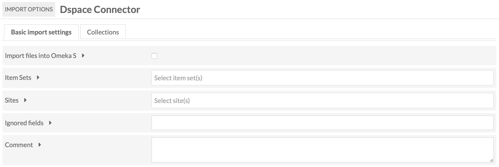

# DSpace Connector

The [DSpace Connector module](https://omeka.org/s/modules/DspaceConnector) allows you to connect an Omeka S instance to a [DSpace repository](https://duraspace.org/dspace/) to import items from that repository. In addition to importing information, the Omeka S item will include a link back to the original item. This allows you to [refresh the information from the source when desired](#update-imported-resources).

Note that DSpace Connector only works with DSpace versions 5.6 and higher, including DSpace 7.x. This connector relies on the DSpace API and its site-by-site configuration.

## Check the API

You may wish to first test that your intended DSpace instance is publicly accessible. To do so, use your browser and test the API endpoint:

- Take the DSpace repository URL and add `/rest/collections` (for versions older than 7.0) 
- Take the DSpace repository URL and add `/server/api/core/collections/` (for 7.x and newer versions).

If you receive an error when loading the page in your browser, the API is not available for import.

## Import data

Navigate to the section labelled "DSpace Connector" under Modules.

On the first form, enter the following information:

* **DSpace site URL** for the repository - the entire URL, including the `http://`
* **Endpoint** for the API (by default this is "rest" but may be changed in the DSpace instance)
* **Limit** or maximum number of results to retrieve at once.
* **Test Import** ONLY if you want to import the # of results indicated in Limit field above from chosen collection on next screen. Useful for testing and fine-tuning.

DSpace versions lower than 7 will likely use "rest" as their endpoint. DSpace versions 7 and above will likely use "server/api" as their endpoint. You will have to enter this manually.

Click the "Get collections and communities" button. If the information above has been correctly entered, you will proceed to the DSpace Connector Import Options page. This has "Basic import settings" and "Collections" tabs.

### Basic import settings
This tab has five options:

* **Import files into Omeka S**: click this checkbox to import files in addition to metadata.
* **Item Set**: select an item set from the dropdown into which to import the items, or create a new item set named for the imported DSpace collection.
* **Sites**: add the imported items to the specified site or sites. Global and user-specific default sites will be pre-selected here.
* **Ignored Fields**: DSpace metadata fields to ignore on import, separated by commas.
* **Comment**: comments to attach to the import batch, which will appear on the "Past DSpace Imports" page.

### Collections
This tab will display the list of collections for the DSpace repository, organized by the containing community. You can import either one collection at a time or the entire DSpace repository.

To import a single collection, click the "Import" button to the left of its name. This will automatically begin the import.

To import the entire repository, click "Import entire repository" at the top of the form.

!!! note
	Importing an entire DSpace repository with a large number of items (more than 5,000) is likely to flood the DSpace hosting server with requests until failure. Consider importing collection by collection. If you still wish to import an entire large repository at once, the following might help:

* On the initial "Import Settings" menu, set **Limit** to a smaller number, such as 50 or 25.
* Test your import by checking the **Test Import** box on the initial "Import Settings" menu.
* Run the import at night and/or whenever there may be less traffic on the DSpace server.
* Consider temporarily inserting [a `sleep()` function](https://www.w3schools.com/php/func_misc_sleep.asp) between the import of each record in `Import.php` to slow the process down slightly (not recommended for production).

You can track the status of imports by navigating to the DSpace Connector "Past Imports" tab, or on the [Jobs](../admin/jobs.md) page of the admin dashboard.

!!! note
	Are your jobs starting and not completing? You might need to [set the path for PHP](../configuration.md#php-path) so that your system can perform the background process to make the items.

## Review imports

The "Past DSpace Imports" page displays a table of past DSpace imports, with a checkbox option to **Undo**, a checkbox option to **Re-run**, the **Job ID** for the import, the repository’s **Dspace Collection Link** (displayed as collection name if found), any **Comments** made during import, the number of **Items** imported with a link to the advanced search results, the **Date** of the import, the import **Status**, and the **Owner**, or user who initiated the import.

DSpace items will import with any metadata fields recognized at the source (such as `dc.title` or `dc.description.abstract`), and will use `bibo:uri` to load the URI as given at the source item as `dc.identifier.uri`. This will be a clickable link that displays on public item pages and allows users to see the item's source at its home DSpace repository. If the fields have one or more language tags, fields imported into Omeka will also use that language tag.

## Update imported resources

To  update resources created using the DSpace Connector, simply check "Re-run" then click "Submit" on the "Past DSpace Imports" page. The resources will be updated, not re-imported. This allows you to use the Connector to sync data between DSpace and Omeka S installations.

## Undo an import

You can view past imports from the "Past DSpace Imports" page. To undo a completed import and remove all associated items, check the box for each import you wish to undo and click the "Submit" button.
